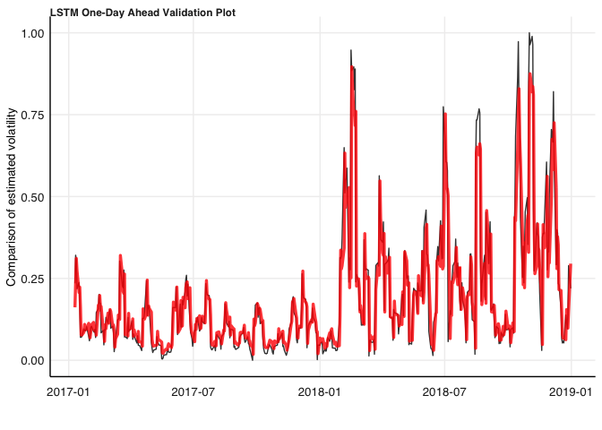
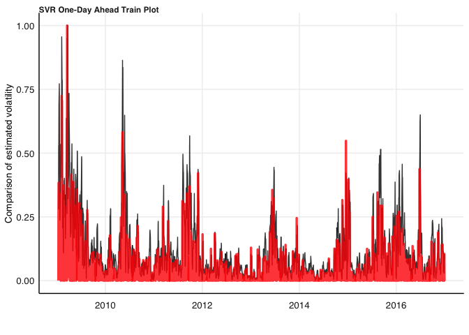
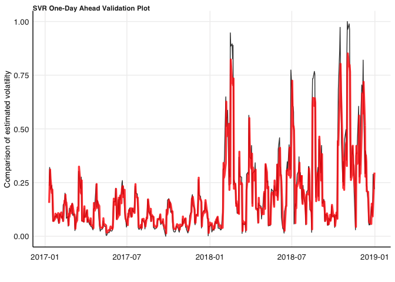
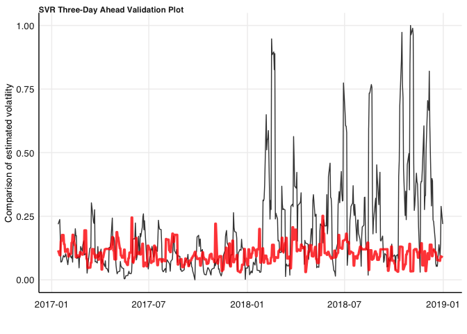

# Purpose

This README is for my Fin Metrics research essay. The aim of the essay
is determine whether volatility forecasting can be improved through the
use of Machine Learning techniques using South African financial data.
The baseline model used will be a GARCH model which is to be compared to
Support Vector Regression and Long-Short Term Memory Recurrent Neural
Network. Squared returns data will be used as the measure for
volatility. Observations will consist of 10 days volatility which
corresponds to two weeks. One day ahead and three day ahead forecasts
will be made. The data is to be split into training, validation and test
sets. Training data will consist of from 2009-2016, validation from
2017-2018, and test for 2019.

``` r
rm(list = ls()) # Clean your environment:
gc() # garbage collection - It can be useful to call gc after a large object has been removed, as this may prompt R to return memory to the operating system.
```

    ##          used (Mb) gc trigger (Mb) limit (Mb) max used (Mb)
    ## Ncells 422026 22.6     872327 46.6         NA   666922 35.7
    ## Vcells 800708  6.2    8388608 64.0     102400  1824018 14.0

``` r
library(tidyverse)
pacman::p_load(rugarch, cowplot, tbl2xts, fmxdat, ggplot2, sugrrants, kableExtra, rsample, glue, tictoc)
list.files('code/', full.names = T, recursive = T) %>% .[grepl('.R', .)] %>% .[!grepl('Old_code', .)] %>% as.list() %>% walk(~source(.))
```

# Data Split

The data used in the practical is the total return index (TRI) of the
ALSI. This is price adjusted for dividends, stock splits and other
corporate actions. The data is split into training, validation and test
series. The training set is from 05-01-2009 to 30-12-2016, the
validation set is from 03-01-2017 to 31-12-2018, and the test set is
from 03-01-2019 to 31-12-2019. Returns, dlogret, are calculated using
log difference of TRI, log(TRI) - log(lag(TRI)). The volatility, sigma,
is calculated as dlogret^2.

``` r
data <- fmxdat::Jalshtr

# Wranlge Data and Create data sets
data_train <- data_wrangling_func(data = data, start_date = "2009-01-01", final_date = "2017-01-01")
  
data_val <- data_wrangling_func(data = data, start_date = "2017-01-01", final_date = "2019-01-01")

data_test <- data_wrangling_func(data = data, start_date = "2019-01-01", final_date ="2020-01-01")

# Create Min-Max Scaled Data Sets

data_train_scaled <- data_wrangling_func(data = data, 
                                  start_date = "2009-01-01", 
                                  final_date = "2017-01-01", 
                                  type = "scaled")
  
data_val_scaled <- data_wrangling_func(data = data, 
                                start_date = "2017-01-01", 
                                final_date = "2019-01-01", 
                                type = "scaled")

data_train_full_scaled <- data_wrangling_func(data = data, 
                                start_date = "2009-01-01", 
                                final_date = "2019-01-01", 
                                type = "scaled")

data_test_scaled <- data_wrangling_func(data = data, 
                                 start_date = "2019-01-01", 
                                 final_date ="2020-01-01", 
                                type = "scaled")
```

# GARCH Model

``` r
# Test for GARCH effects
cond_het <- test_cond_het_func(data_train)

# Find best model
best_mod <- vol_select_func(data_train)
best_mod
```

    ##                 sGARCH  gjrGARCH    eGARCH    apARCH
    ## Akaike       -6.452107 -6.482330 -6.490124 -6.476212
    ## Bayes        -6.438554 -6.466067 -6.473860 -6.457238
    ## Shibata      -6.452119 -6.482347 -6.490140 -6.476235
    ## Hannan-Quinn -6.447141 -6.476371 -6.484164 -6.469259

``` r
# Train

# Fit Model
garch_fit <- vol_func(data_train, "eGARCH")
# Model Coefficients
garch_fit@fit$matcoef
```

    ##             Estimate   Std. Error       t value     Pr(>|t|)
    ## mu      0.0003515747 2.130849e-04     1.6499274 9.895778e-02
    ## ar1     0.0125580135 3.000059e-02     0.4185922 6.755142e-01
    ## omega  -0.1158799416 3.678887e-03   -31.4986395 0.000000e+00
    ## alpha1 -0.1229697781 1.276882e-02    -9.6304719 0.000000e+00
    ## beta1   0.9876109595 3.831107e-05 25778.7351700 0.000000e+00
    ## gamma1  0.0827979223 8.778569e-03     9.4318240 0.000000e+00
    ## shape  11.8303799861 2.471258e+00     4.7871886 1.691339e-06

``` r
# Plot Model
vol_plot_func(data = data_train_scaled, 
              fit = sigma(garch_fit) %>% xts_tbl()%>% 
                rename(sigma = coredata.xts.) %>% 
                mutate(date = as.Date(date)) %>% 
                mutate(sigma = (sigma - min(data_train$y))/(max(data_train$y) - min(data_train$y))/100),
              title = "Comparison: Returns Sigma vs Sigma from Garch")
```


``` r
# Val

# Fit Model
garch_fit_val <- vol_func(data_val, "eGARCH")
# Model Coefficients
stargazer::stargazer(garch_fit_val@fit$matcoef, type = "html")
```

    ## 
    ## <table style="text-align:center"><tr><td colspan="5" style="border-bottom: 1px solid black"></td></tr><tr><td style="text-align:left"></td><td>Estimate</td><td>Std. Error</td><td>t value</td><td>Pr(> | t| )</td></tr>
    ## <tr><td colspan="5" style="border-bottom: 1px solid black"></td></tr><tr><td style="text-align:left">mu</td><td>0.0003</td><td>0.0003</td><td>0.951</td><td>0.342</td></tr>
    ## <tr><td style="text-align:left">ar1</td><td>0.026</td><td>0.044</td><td>0.599</td><td>0.549</td></tr>
    ## <tr><td style="text-align:left">omega</td><td>-0.324</td><td>0.007</td><td>-46.199</td><td>0</td></tr>
    ## <tr><td style="text-align:left">alpha1</td><td>-0.149</td><td>0.022</td><td>-6.639</td><td>0</td></tr>
    ## <tr><td style="text-align:left">beta1</td><td>0.967</td><td>0.0001</td><td>8,874.838</td><td>0</td></tr>
    ## <tr><td style="text-align:left">gamma1</td><td>0.061</td><td>0.027</td><td>2.257</td><td>0.024</td></tr>
    ## <tr><td style="text-align:left">shape</td><td>8.276</td><td>2.892</td><td>2.862</td><td>0.004</td></tr>
    ## <tr><td colspan="5" style="border-bottom: 1px solid black"></td></tr></table>

``` r
# Plot Model
vol_plot_func(data = data_val_scaled, 
              fit = sigma(garch_fit_val) %>% xts_tbl()%>% 
                rename(sigma = coredata.xts.) %>% 
                mutate(date = as.Date(date)) %>% 
                mutate(sigma = (sigma - min(data_val$y))/(max(data_val$y) - min(data_val$y))/100),
              title = "Comparison: Returns Sigma vs Sigma from Garch")
```


# LSTM Model

Connect to python virtual environment with reticulate. Install and load
tensorflow and keras.

``` r
pacman::p_load(reticulate)

reticulate::use_virtualenv("/Users/jonathanrossouw/Desktop/Masters/Dat Sci/ML/Project/.venv", require = TRUE)
# reticulate::py_config()
# Install Tensorflow and Keras in virtual environment
### virtualenv_install(".venv/", "tensorflow")
### install_tensorflow()
### install_keras()
# Load Tensorflow and Keras
library(tensorflow)
library(keras)
```

Wrangle data for LSTM. Use min-max scaling on series. Store min-max
values for later rescaling. Plot new scaled training data.

## One Day Forecast

Create lists of arrays with correct structure for LSTM model. The
previous two days return and two days volatility are used as inputs with
a single day’s volatility being predicted.

``` r
### Create LSTM Data Arrays
data_lstm_lists <- data_array_func(data = data_train_scaled, 
                              val = data_val_scaled,
                              initial = 1, 
                              assess = 1, 
                              skip = 0, 
                              type = "one_day")
```

Create grid of hyperparameters for tuning. Epochs, number of LSTM
layers, number of LSTM units, whether or not there is a return sequence
and the dropout rate are used as hyperparameters.

``` r
##### Set hyperparameter grid
# lstm_hyp <- expand.grid(loss = c("mse"),
#                         optimizer = c("adam"),
#                         epochs = c(10, 20, 50, 100),
#                         lstm_layers = c(1, 2),
#                         lstm_units = c(10, 20, 40),
#                         return_sequences = c(TRUE, FALSE),
#                         dropout_rate = c(0, 0.1)) %>%
#     filter(!(return_sequences == TRUE & lstm_layers == 1)) %>%
#     split(., seq(nrow(.)))

lstm_hyp <- expand.grid(loss = c("mse"),
                        optimizer = c("adam"),
                        epochs = c(20),
                        lstm_layers = c(2),
                        lstm_units = c(10),
                        return_sequences = c(FALSE),
                        dropout_rate = c(0)) %>%
    filter(!(return_sequences == TRUE & lstm_layers == 1)) %>%
    split(., seq(nrow(.)))
```

Using a grid search, train the LSTM model and predict the one-day ahead
forecast for the validation set. Select the combination of
hyperparameters that result in the lowest MSE for the validation set.
Plot the training data and forecast and plot the validation set and the
forecast.

``` r
#### Fit the best univariate LSTM according to the results of 
# the hyperparameter tuning

lstm_fit <- hyp_tune_func(data_lists = data_lstm_lists,
                         data_actual = data_val_scaled %>% tail(-1), 
                         hyperparams = lstm_hyp, 
                         fit_func = lstm_fit_func,
                         type = "lstm")

write.csv(lstm_fit, "cache/lstm_tune")

best_lstm_tune <- lstm_fit %>%  
  filter(mse == min(mse))

lstm_perf <- perf_plot(data_lists = data_lstm_lists,
                       data_val = data_val_scaled %>% tail(-1), 
                       data_train = data_train_scaled %>% tail(-1),
                       hyperparams = best_lstm_tune,
                       fit_func = lstm_fit_func,
                       type = "lstm",
                       train_title = "LSTM Train Plot",
                       val_title = "LSTM Validation Plot")

lstm_perf$train_plot
```


``` r
lstm_perf$training_error
```

    ## # A tibble: 1 × 8
    ##   loss  optimizer epochs lstm_layers lstm_units return_sequences dropout_rate
    ##   <fct> <fct>      <dbl>       <dbl>      <dbl> <lgl>                   <dbl>
    ## 1 mse   adam          20           2         10 FALSE                       0
    ## # … with 1 more variable: mse <dbl>

``` r
lstm_perf$val_plot
```



``` r
lstm_perf$performance
```

    ## # A tibble: 1 × 8
    ##   loss  optimizer epochs lstm_layers lstm_units return_sequences dropout_rate
    ##   <fct> <fct>      <dbl>       <dbl>      <dbl> <lgl>                   <dbl>
    ## 1 mse   adam          20           2         10 FALSE                       0
    ## # … with 1 more variable: mse <dbl>

## Three Day Forecast

Create lists of arrays with correct structure for LSTM model. The
previous four days return and four days volatility are used as inputs
with the following three day’s volatility being forecast.

``` r
### Create LSTM Data Arrays
data_lstm_lists_3 <- data_array_func(data = data_train_scaled, 
                              val = data_val_scaled,
                              initial = 2,
                              assess = 1,
                              skip = 0, 
                              type = "three_day")
```

Create grid of hyperparameters for tuning. Epochs, number of LSTM
layers, number of LSTM units, whether or not there is a return sequence
and the dropout rate are used as hyperparameters.

``` r
##### Set hyperparameter grid
lstm_hyp_3 <- expand.grid(loss = c("mae"),
                        optimizer = c("adam"),
                        epochs = c(20),
                        lstm_layers = c(2),
                        lstm_units = c(10),
                        return_sequences = c(FALSE),
                        dropout_rate = c(0.1)) %>%
    filter(!(return_sequences == TRUE & lstm_layers == 1)) %>%
    split(., seq(nrow(.)))
```

Using a grid search, train the LSTM model and predict the three-day
ahead forecast for the validation set. Select the combination of
hyperparameters that result in the lowest MSE for the validation set.
Plot the training data and forecast and plot the validation set and the
forecast.

``` r
#### Fit the best univariate LSTM according to the results of 
# the hyperparameter tuning

lstm_fit_3 <- hyp_tune_func(data_lists = data_lstm_lists_3,
                         data_actual = data_val_scaled %>% tail(-4), 
                         hyperparams = lstm_hyp_3, 
                         fit_func = lstm_fit_func,
                         type = "lstm")

write.csv(lstm_fit, "cache/lstm_tune")

best_lstm_tune_3 <- lstm_fit_3 %>%  
  filter(mse == min(mse))

lstm_perf_3 <- perf_plot(data_lists = data_lstm_lists_3,
                         data_train = data_train_scaled %>% tail(-4),
                         data_val = data_val_scaled %>% tail(-4), 
                       hyperparams = best_lstm_tune_3,
                       fit_func = lstm_fit_func,
                       type = "lstm",
                       train_title = "LSTM Train Plot",
                       val_title = "LSTM Validation Plot")

lstm_perf_3$train_plot
```


``` r
lstm_perf_3$val_plot
```


``` r
lstm_perf_3$performance
```

    ## # A tibble: 1 × 8
    ##   loss  optimizer epochs lstm_layers lstm_units return_sequences dropout_rate
    ##   <fct> <fct>      <dbl>       <dbl>      <dbl> <lgl>                   <dbl>
    ## 1 mae   adam          20           2         10 FALSE                     0.1
    ## # … with 1 more variable: mse <dbl>

``` r
lstm_perf_3$training_error
```

    ## # A tibble: 1 × 8
    ##   loss  optimizer epochs lstm_layers lstm_units return_sequences dropout_rate
    ##   <fct> <fct>      <dbl>       <dbl>      <dbl> <lgl>                   <dbl>
    ## 1 mae   adam          20           2         10 FALSE                     0.1
    ## # … with 1 more variable: mse <dbl>

# SVR

Load in the support vector machine package. Create the list of arrays
where the previous two day’s returns and volatility are used as the
variables and the next days volatility is the target. Create data frames
from the arrays to be used by the SVM.

## One Day Forecast

``` r
library(liquidSVM)

## One Day Forecast
# Create list of training and validation sets

data_svr_array <- data_array_func(data = data_train_scaled,
                                  val = data_val_scaled,
                                  initial = 1,
                                  assess = 1,
                                  skip = 0, 
                                  type = "one_day")

data_svr_lists <- data_svr_wrangle(data_array = data_svr_array)
```

Create a grid of hyperparameters. The gamma and lambda are tuned over.
Using a grid-search, fit the SVM to the training data and forecast the
one-day ahead volatility from the validation set.

``` r
# Tune SVR regressions
svr_hyp <- expand.grid(gamma = c(exp(-2.5)),
                       lambda = c(exp(-2.5))) %>%
    split(., seq(nrow(.)))

svr_fit <- hyp_tune_func(data_lists = data_svr_lists,
                         data_actual = data_val_scaled %>% tail(-1),
                         hyperparams = svr_hyp,
                         fit_func = svr_fit_func, 
                         type = "svr")
```

    ## [1] "1 DONE!!"
    ## [1] "DONE!!"

Select the combination of hyperparameters that resulted in the lowest
MSE of the validation set. Create plots of the training data and
forecasts and the valdiation data and forecasts. Determine forcast
performance with MSE.

``` r
# Best hyperparameters

best_tune_svr <- svr_fit %>% filter(mse == min(mse))

# Plot performance
svr_perf <- perf_plot(data_lists = data_svr_lists,
                      data_train = data_train_scaled %>% tail(-1),
                      data_val = data_val_scaled %>% tail(-1), 
                      hyperparams = best_tune_svr[1,],
                      fit_func = svr_fit_func,
                      type = "svr",
                      train_title = "SVR Train Plot",
                      val_title = "SVR Validation Plot")
```

    ## [1] "1 DONE!!"
    ## [1] "DONE!!"

``` r
svr_perf$train_plot
```



``` r
svr_perf$training_error
```

    ## # A tibble: 1 × 3
    ##    gamma lambda     mse
    ##    <dbl>  <dbl>   <dbl>
    ## 1 0.0821 0.0821 0.00342

``` r
svr_perf$val_plot
```



``` r
svr_perf$performance
```

    ## # A tibble: 1 × 3
    ##    gamma lambda     mse
    ##    <dbl>  <dbl>   <dbl>
    ## 1 0.0821 0.0821 0.00968

## Three Day Forecast

Create the list of arrays where the previous four day’s returns and
volatility are used as the variables and the next three days’ volatility
is the target. Create data frames from the arrays to be used by the SVM.

``` r
# Create list of training and validation sets

data_svr_array_3 <- data_array_func(data = data_train_scaled,
                                  val = data_val_scaled,
                                  initial = 2,
                                  assess = 1,
                                  skip = 0, 
                                  type = "three_day")

data_svr_lists_3 <- data_svr_wrangle(data_array = data_svr_array_3)
```

Create a grid of hyperparameters. The gamma and lambda are tuned over.
Using a grid-search, fit the SVM to the training data and forecast the
three-day ahead volatility from the validation set.

``` r
# Tune SVR regressions
svr_hyp_3 <- expand.grid(gamma = c(exp(-2.5)),
                       lambda = c(exp(-2.5))) %>%
    split(., seq(nrow(.)))

svr_fit_3 <- hyp_tune_func(data_lists = data_svr_lists_3,
                         data_actual = data_val_scaled %>% tail(-4),
                         hyperparams = svr_hyp_3,
                         fit_func = svr_fit_func, 
                         type = "svr")
```

    ## [1] "1 DONE!!"
    ## [1] "DONE!!"

Select the combination of hyperparameters that resulted in the lowest
MSE of the validation set. Create plots of the training data and
forecasts and the validation data and forecasts. Determine forecast
performance with MSE.

``` r
# Best hyperparameters

best_tune_svr_3 <- svr_fit_3 %>% filter(mse == min(mse))

# Plot performance
svr_perf_3 <- perf_plot(data_lists = data_svr_lists_3,
                         data_train = data_train_scaled %>% tail(-4),
                         data_val = data_val_scaled %>% tail(-4), 
                      hyperparams = best_tune_svr_3[1,],
                      fit_func = svr_fit_func,
                      type = "svr",
                      train_title = "SVR Train Plot",
                      val_title = "SVR Validation Plot")
```

    ## [1] "1 DONE!!"
    ## [1] "DONE!!"

``` r
svr_perf_3$train_plot
```


``` r
svr_perf_3$training_error
```

    ## # A tibble: 1 × 3
    ##    gamma lambda     mse
    ##    <dbl>  <dbl>   <dbl>
    ## 1 0.0821 0.0821 0.00813

``` r
svr_perf_3$val_plot
```



``` r
svr_perf_3$performance
```

    ## # A tibble: 1 × 3
    ##    gamma lambda    mse
    ##    <dbl>  <dbl>  <dbl>
    ## 1 0.0821 0.0821 0.0462

# Test
